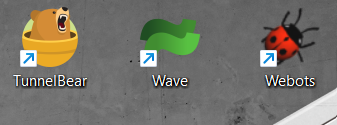
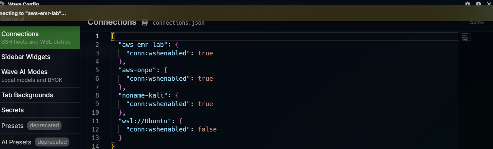
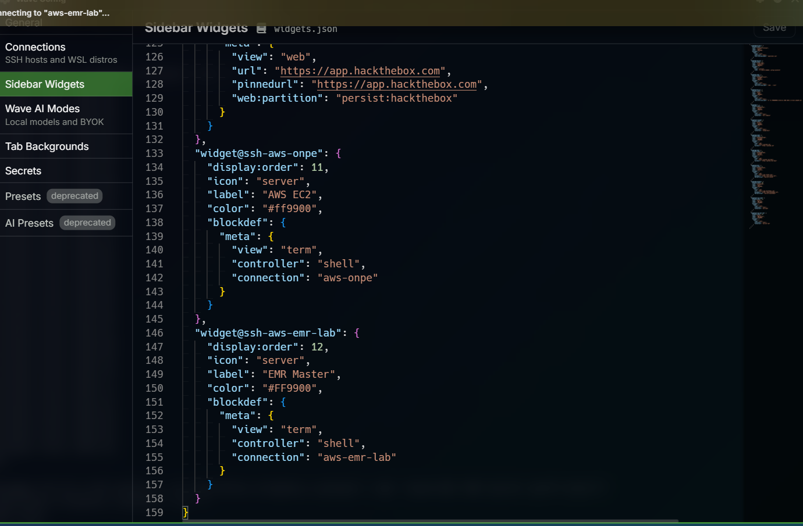
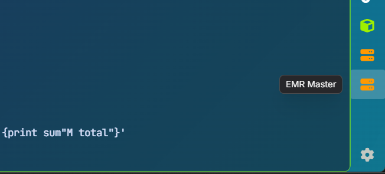
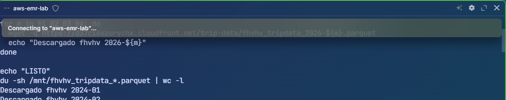

# dev-environment-setup

Configuración de entorno de desarrollo SSH, Wave Terminal y conexiones remotas.

---

## Contenido

```
dev-environment-setup/
├── README.md
├── ssh/
│   └── config.example    plantilla de ~/.ssh/config
└── wave/
    ├── connections.json   conexiones Wave
    └── widgets.json       widgets de terminal Wave
```

---

## Wave Terminal

Wave es un terminal moderno con soporte nativo para conexiones SSH, WSL y widgets personalizados. Permite abrir sesiones remotas con un click desde la barra lateral.

- Descarga: https://www.waveterm.dev
- Documentación: https://docs.waveterm.dev

### Abrir Wave
Desde el ejecutable instalado o desde PowerShell:
```powershell
# Crear alias para abrir Wave desde terminal
Set-Alias waveterm "C:\Users\TU_USUARIO\AppData\Local\Programs\Waveterm\Wave.exe"
waveterm
```

---

## Configuración SSH

### 1. Descargar la clave

**Vocareum (EMR labs):** en la página del lab ir a `AWS Details → Download PEM → labsuser.pem`

**EC2 general:** descargar el `.pem` desde la consola de AWS al crear la instancia.

**Kali Linux VM:** generar clave RSA y copiar al host:
```powershell
ssh-keygen -t rsa -b 4096
type $env:USERPROFILE\.ssh\id_rsa.pub | ssh noname@192.168.56.101 "mkdir -p ~/.ssh && cat >> ~/.ssh/authorized_keys"
```

### 2. Crear el archivo config

```powershell
# Crear si no existe
touch C:\Users\TU_USUARIO\.ssh\config

# Editar
notepad C:\Users\TU_USUARIO\.ssh\config
```

Contenido ver plantilla en `ssh/config.example`:

```
Host aws-emr-lab
    HostName <DNS-del-master>
    User hadoop
    IdentityFile C:/Users/TU_USUARIO/Documents/labsuser.pem

Host aws-onpe
    HostName <IP-publica>
    User ec2-user
    IdentityFile C:/Users/TU_USUARIO/Documents/onpe.pem

Host noname-kali
    HostName 192.168.56.101
    User noname
    IdentityFile C:/Users/TU_USUARIO/.ssh/id_rsa
```

### 3. Conectarse

```powershell
# Con alias (recomendado)
ssh aws-emr-lab
ssh aws-onpe
ssh noname-kali

# Sin alias emr
ssh -i labsuser.pem hadoop@<DNS-del-master>

# Sin alias onpe
ssh -i onpe.pem ec2-user@<IP-publica>

# Sin alias kali
ssh -i id_rsa noname@<IP-kali>
```

### 4. Copiar archivos (SCP)

```powershell
# Subir archivo al master
scp archivo.txt aws-emr-lab:~/

# Descargar archivo del master
scp aws-emr-lab:~/archivo.txt .

# Subir script HiveQL
scp scripts/02_wordcount.hql aws-emr-lab:~/
```

> El alias SSH funciona igual desde terminal tradicional y desde Wave.

### Nota: IP cambia al reiniciar

En Vocareum cada nuevo clúster EMR tiene un DNS diferente. Actualiza `HostName` en el config:

```powershell
notepad C:\Users\TU_USUARIO\.ssh\config
# Cambiar HostName por el nuevo DNS del master
```

---

## Configuración Wave

Wave usa el mismo `~/.ssh/config` si el alias está configurado, Wave lo detecta automáticamente.

### Archivos de configuración Wave

Los archivos se editan con:
```bash
wsh editconfig connections.json
wsh editconfig widgets.json
```

O directamente en:
```
C:\Users\TU_USUARIO\.config\waveterm\connections.json
C:\Users\TU_USUARIO\.config\waveterm\widgets.json
```

### connections.json

Habilita las conexiones SSH en Wave copiar contenido de `wave/connections.json`:

```json
{
  "aws-emr-lab": { "conn:wshenabled": true },
  "aws-onpe": { "conn:wshenabled": true },
  "noname@192.168.56.101": { "conn:wshenabled": true },
  "wsl://Ubuntu": { "conn:wshenabled": false }
}
```

### widgets.json

Define los widgets de acceso rápido en la barra lateral copiar contenido de `wave/widgets.json`.

Cada widget abre una terminal conectada al host al hacer click.

---

## Personalización Wave (opcional)

### Tema y fuente

Edita `settings.json`:
```json
{
  "term:theme": "rosepine",
  "term:fontfamily": "JetBrains Mono",
  "term:fontsize": 14,
  "tab:preset": "bg@blade1"
}
```

Temas disponibles en el repositorio oficial:
https://github.com/wavetermdev/waveterm/blob/main/pkg/wconfig/defaultconfig/termthemes.json

### Background

```bash
wsh setbg C:\Users\TU_USUARIO\Pictures\blade5.jpg
```

### Búsqueda web integrada

```bash
wsh web open python documentation
wsh web open c++
```

---

## Wave AI (opcional)

Wave soporta modelos de IA directamente en el terminal.

```bash
# Configurar clave
wsh secret set GROQ_KEY=tu_clave_aqui

# Establecer modelo por defecto
wsh setconfig waveai:defaultmode="groq-llama"
```

Documentación: https://docs.waveterm.dev/waveai-modes

> Para automatización avanzada con Wave AI (generar archivos desde el terminal y enviarlos a sesiones SSH remotas) ver: https://github.com/DiegoRivas1/wave-bridge

---

## Capturas

### Wave abierto desde ejecutable


### Configuración connections.json


### Configuración widgets.json


### Widget EMR activo en barra lateral


### Sesión SSH al master EMR desde Wave

